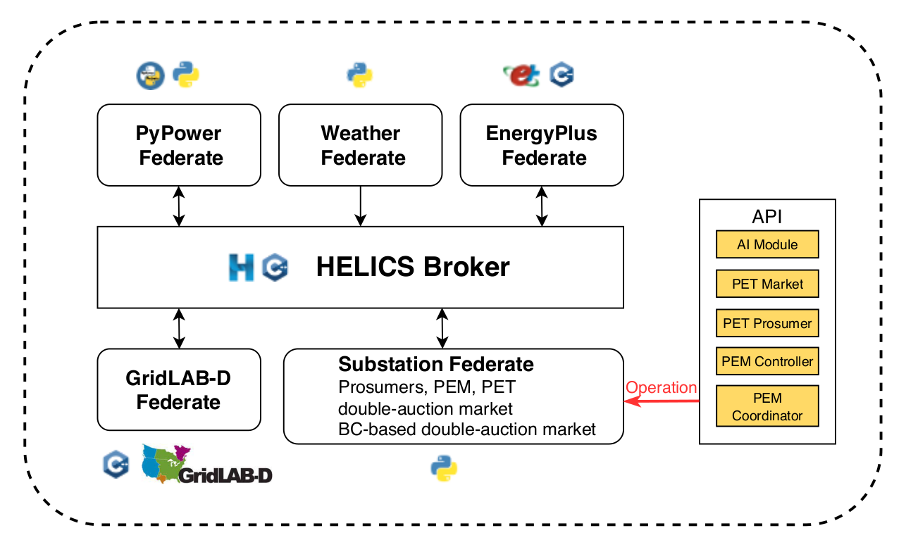
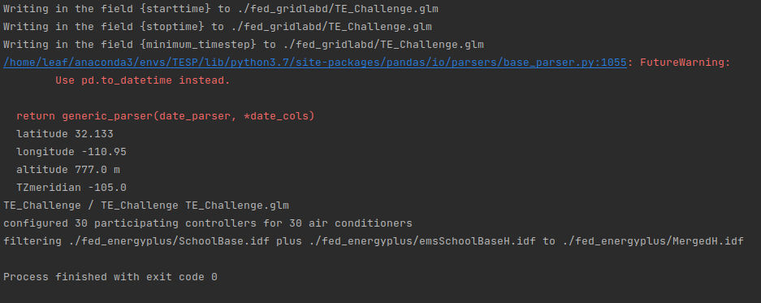
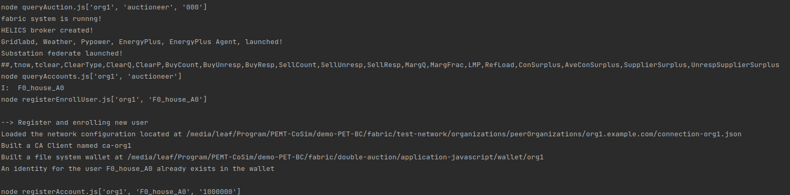

# PEMT-CoSim-Blockchain-Enabled

A Co-Simulation Platform For Packetized Energy Management and Trading with Blockchain Integrated with Blockchain

## 1. Description
This sub-project implements an Energy Trading Market using Fabric Blockchain, which interacts with the blockchain during program execution to enhance transaction transparency and fairness. Due to the need for Fabric Blockchain to run separately in Docker, it cannot be integrated into the Docker of PEMT-CoSim (running Docker in Docker would increase development difficulty). Therefore, in this project, PEMT-CoSim runs locally, while Fabric runs in Docker. PEMT-CoSim will interact with smart contracts on Fabric through the provided JavaScript program. We referred to the repository https://github.com/xuyangm/double-auction for the implementation of the Fabric code.



<center>PEMT-CoSim Architecture</center>

## 2. Installation
PEMT-CoSim runs natively on Linux, and the Fabric Blockchain runs inside multiple Docker containers in this subproject. To enable the operation, Docker, TESP, and Python packages need to be installed.

### 2.1 OS Environment

Please make sure using Ubuntu 20.04 LTS. The latest version of Ubuntu may not install the 1.0.0 version TESP.

Before the installation, the [Docker or Docker Desktop](https://www.docker.com/products/docker-desktop),  [Git](https://git-scm.com/) and docker compose should be installed. 

    sudo curl -L "https://github.com/docker/compose/releases/latest/download/docker-compose-$(uname -s)-$(uname -m)" -o /usr/local/bin/docker-compose
    sudo chmod +x /usr/local/bin/docker-compose
    docker-compose --version

### 2.2 Installation of TESP
Please run the command line below in sequence to install the TESP (https://github.com/pnnl/tesp)

    curl -L https://github.com/pnnl/tesp/releases/download/v1.0.0/tesp-1.0.0-linux-x64-installer.run -o tesp-1.0.0-linux-x64-installer.run
    chmod +x tesp-1.0.0-linux-x64-installer.run
    sudo ./tesp-1.0.0-linux-x64-installer.run


### 2.3 Python Environment
You can use Anaconda to build an environment

    apt install python3.8-pip
    cd ./demo-PET-BC
    pip install -r requirements.txt

### 2.4 Go Environment
The go version tested is go1.13.8, different version may cause program crash. But before you find error, you can use apt to install a pre-defined goland module.

    sudo apt update
    sudo apt install golang


### 2.5 Javascript Environment

    cd ./demo-PET-BC/fabric/double-auction/application-javascript/test
    npm init
    npm install
    npm install fabric-ca-client && npm install fabric-network && npm install perf_hooks
    npm audit fix

### 2.6 Install JQ

    sudo apt update
    sudo apt install jq

## 3. Run Cases

- Set up the Fabric Blockchain Instance.
    ```
    cd ./demo-PET-BC/fabric/double-auction/application-javascript/test
    sudo bash ./reset.sh
    sudo bash ./start.sh
    ```
  The scripts will set up the blockchain with 9 dockers. You can visualize it using the VS code extension. Please try to use ./reset.sh to reset all docker instances if you encountered any unknown errors.

- Generate a study case of simulation.
    ```
    cd ./PEMT-CoSim/demo-PET-BC
    python3 generate_case.py 
    ```
  This python script will generate a study case based on user configuration

  

- Start the Blockchain-based energy trading market.
    ```
    cd /PEMT-CoSim/demo-PET/fed_substation/
    python3 launch_substation.py
    ```
  If executed successfully, the console will print out the bidding information and process.

  